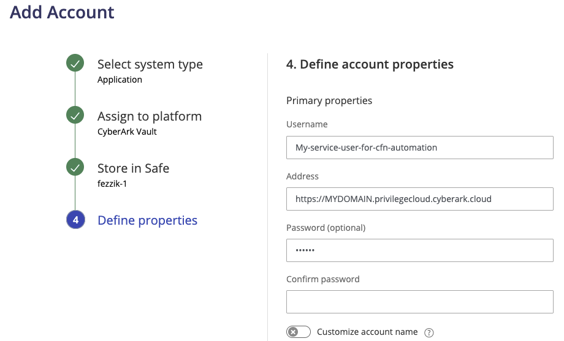
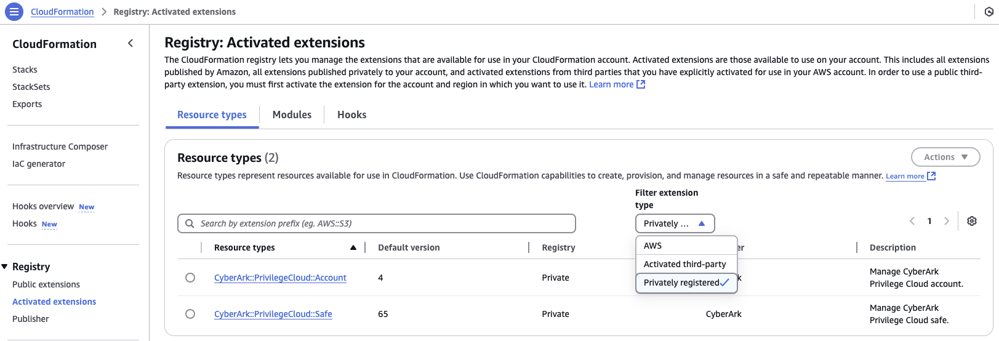

<!-- START doctoc generated TOC please keep comment here to allow auto update -->
<!-- DON'T EDIT THIS SECTION, INSTEAD RE-RUN doctoc TO UPDATE -->
<!-- END doctoc generated TOC please keep comment here to allow auto update -->


# CyberArk Cloudformation Resource Providers
<!--
Author:   David Hisel <david.hisel@cyberark.com>
Updated:  <2025-03-12 13:01:25 david.hisel>
-->

## Summary

CloudFormation custom provider for CyberArk create safe and create account.

### User Stories

- As an AWS Cloudformation template developer, create a CloudFormation template that can create a Privilege Cloud Safe.
- As an AWS Cloudformation template developer, and given an existing Privilege Cloud Safe, create a CloudFormation template that can create an account in a Privilege Cloud Safe.

## Quick Start

### Pre Requirements

1. Conjur Setup
   a. Create Conjur AWS IAM authentictor - [CyberArk Docs link](https://docs.cyberark.com/conjur-cloud/latest/en/content/operations/authn/authenticate-awsiam-lp.htm)
   b. Copy `creds.toml.exmple` and name it `creds.toml`
   c. Edit creds.toml and update the values for your Conjur environment

2. Identity User Setup
   a. Create an ISPSS service account - [CyberArk Docs link](https://docs.cyberark.com/identity-administration/latest/en/content/ispss/ispss-api-authentication.htm), [CyberArk API Docs link](https://api-docs.cyberark.com/docs/ispss-api-auth/2c297daca8a97-api-token-authentication-for-cyber-ark-identity-security-platform-shared-services)
   b. Permissions required: Safe Management, Account Creation, and Role Creation

3. Privilege Cloud Setup
   a. Ensure synchronize to Conjur is enabled and working
   b. Create a safe to hold the Identity user that was created in a previous step
   c. Create an account in the safe using the "CyberArk Vault" platform type
      - Store the Privilege Cloud URL in the field "Address"
      - Store service account username in the field "Username"
      - Store service account password in the field "Password"
      Example screenshot:
       
   d. Store the Conjur paths to the values in the `creds.toml`

4. AWS EC2 instance
   - Spinup an EC2 instance where the CloudFormation custom provider will be used.
   - Ensure all the required tools are installed:
     - Python3 -- to support cfn and aws cli
     - Go v1.22 -- permissions to install go applications
     - Bash
     - run the "bootstrap.sh" script, this will create a python3 virtual environment and install the CFN cli
     - install aws cli -- [awscli install doc link](https://docs.aws.amazon.com/cli/latest/userguide/getting-started-install.html)
     - jq
     - GNU Make
     - Linux commands: cat, rm, sed, awk
   - All commands in the Build and Deploy setps should be run from this EC2 instance.

### Build And Deploy The Custom Providers

#### Environment Preparation

**_Run Once:_**

```bash
bash bootstrap.sh
source ./venv/bin/activate
```

IMPORTANT: if this is not run, then steps may fail, run this in new shells, such as logging into the ec2 instance.

**_Run Every time:_**

```bash
# From parent dir
source ./venv/bin/activate
```

#### Safe Provider

STOP! First, [prepare environment](#environment-preparation)

This will deploy the "CyberArk::PrivilegeCloud::Safe" custom provider to CloudFormation as an activated extension and privately registerd.


```bash
source ./venv/bin/activate

# Build and Deploy to CF
cd cyberark-privilegecloud-safe/
make register

# Set the configuration
# ensure that `../creds.toml` exists, then register the configuration
[ -f ../creds.toml ] && make register-configuration
```

To view it, go to AWS Console 
  -> CloudFormation 
  -> (Left Nav) Registry: Activated extentions
  -> "Filter extention type" set to "Privately registered"
  
  Screenshot showing custom provider deployed:
  

#### Account Provider

STOP! First, [prepare environment](#environment-preparation)

This will deploy the "CyberArk::PrivilegeCloud::Account" custom provider to CloudFormation as an activated extension and privately registerd.

1. Copy `Makefile.local.example` to `Makefile.local`
2. Edit `Makefile.local` and set the 2 required variables

```makefile
# Safe where CF template will store accounts
TARGET_SAFE_NAME := DemoSafe-34

# AWS Region where CyberArk::PrivilegeCloud::Account custom provider is deployed
STACK_AWS_REGION := us-east-1
```

```bash
source ./venv/bin/activate

# Build and Deploy to CF
cd cyberark-privilegecloud-account/
make register

# Set the configuration
# ensure that `../creds.toml` exists, then register the configuration
[ -f ../creds.toml ] && make register-configuration
```

To view it, go to AWS Console 
  -> CloudFormation 
  -> (Left Nav) Registry: Activated extentions
  -> "Filter extention type" set to "Privately registered"
  
  Screenshot showing custom provider deployed:
  

### Create Sample CF Templates

STOP! First, [prepare environment](#environment-preparation)

```bash
source ./venv/bin/activate

cd cyberark-privilegecloud-safe
make cfn-safe.json
cat cfn-safe.json  # Example Safe CF template

cd ..  # back to parent

# (Optional) Edit Makefile.local to change safe name
cd cyberark-privilegecloud-account
make cfn-account.json
cat cfn-account.json  # Example Account CF template

cd ..  # back to parent
```

## Contributing

We welcome contributions of all kinds to this repository. For instructions on how to get started and descriptions of our development workflows, please see our [contributing guide](./CONTRIBUTING.md).

## License

This repository is licensed under Apache License 2.0 - see [LICENSE](./LICENSE) for more details.